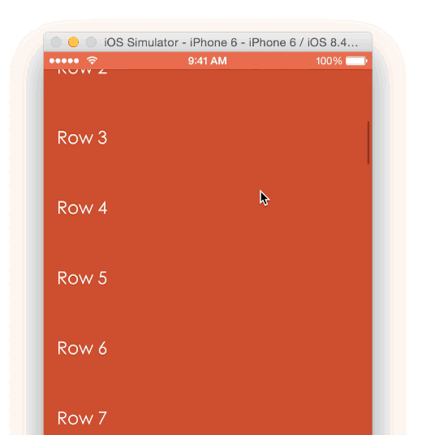

<p align="center">
  
</p>

[](http://www.cocoapods.org/?q=amscrollingnavbar)
[](https://travis-ci.org/andreamazz/AMScrollingNavbar)
[](https://codecov.io/github/andreamazz/AMScrollingNavbar?branch=master)
[](https://github.com/Carthage/Carthage)

[](https://gitter.im/andreamazz/AMScrollingNavbar?utm_source=badge&utm_medium=badge&utm_campaign=pr-badge&utm_content=badge)
[](https://www.paypal.com/cgi-bin/webscr?cmd=_s-xclick&hosted_button_id=46FNZD4PDVNRU)

A custom UINavigationController that enables the scrolling of the navigation bar alongside the
scrolling of an observed content view  

<p align="center">
  <a href='https://appetize.io/app/31qahv9v4477ja36k8dn93wr8m' alt='Live demo'>
    
  </a>
</p>

### Versioning notes

Version `2.x` is written as a subclass of `UINavigationController`, in Swift.  
Version `2.0.0` introduce Swift 2.0 syntax. Checkout `2.0.0.beta` for Swift 1.2.  
If you are looking for the category implementation in Objective-C, make sure to checkout version `1.x` and prior, although the `2.x` is recomended.

#Screenshot

<p align="center">
  
</p>

#Setup with CocoaPods

```
pod 'AMScrollingNavbar', '~> 2.0.1'

use_frameworks!
```

#Setup with Carthage

```
github "andreamazz/AMScrollingNavbar"
```

##Usage

Make sure to use a subclass of `ScrollingNavigationController` for your `UINavigationController`. Either set the class of your `UINavigationController` in your storyboard, or create programmatically a `ScrollingNavigationController` instance in your code.

Use `followScrollView(_: delay:)` to start following the scrolling of a scrollable view (e.g.: a `UIScrollView` or `UITableView`).
####Swift
```swift
override func viewWillAppear(animated: Bool) {
    super.viewWillAppear(animated)

    if let navigationController = self.navigationController as? ScrollingNavigationController {
        navigationController.followScrollView(tableView, delay: 50.0)
    }
}
```

####Objective-C
```objc
- (void)viewWillAppear:(BOOL)animated {
    [super viewWillAppear:animated];

    [(ScrollingNavigationController *)self.navigationController followScrollView:self.tableView delay:50.0f];
}
```

Use `stopFollowingScrollview()` to stop the behaviour. Remember to call this function on disappear:
```swift
override func viewDidDisappear(animated: Bool) {
    super.viewDidDisappear(animated)

    if let navigationController = self.navigationController as? ScrollingNavigationController {
        navigationController.stopFollowingScrollView()
    }
}
```

##ScrollingNavigationViewController
To DRY things up you can let your view controller subclass `ScrollingNavigationViewController`, which provides the base setup implementation. You will just need to call `followScrollView(_: delay:)`:
```swift
override func viewWillAppear(animated: Bool) {
    super.viewWillAppear(animated)

    if let navigationController = self.navigationController as? ScrollingNavigationController {
        navigationController.followScrollView(tableView, delay: 50.0)
    }
}
```

##ScrollingNavigationControllerDelegate
You can set a delegate to receive a call when the state of the navigation bar changes:
```swift
if let navigationController = self.navigationController as? ScrollingNavigationController {
    navigationController.scrollingNavbarDelegate = self
}
```

Delegate function:
```swift
func scrollingNavigationController(controller: ScrollingNavigationController, didChangeState state: NavigationBarState) {
    switch state {
    case .Collapsed:
        print("navbar collapsed")
    case .Expanded:
        print("navbar expanded")
    case .Scrolling:
        print("navbar is moving")
    }
}
```

##Handling navigation
If the view controller with the scroll view pushes new controllers, you should call `showNavbar(animated:)` in your `viewWillDisappear(animated:)`:
```swift
override func viewWillDisappear(animated: Bool) {
  super.viewWillDisappear(animated)
    if let navigationController = self.navigationController as? ScrollingNavigationController {
      navigationController.showNavbar(animated: true)
    }
}
```

##Scrolling to top
When the user taps the status bar, by default a scrollable view scrolls to the top of its content. If you want to also show the navigation bar, make sure to include this in your controller:

```swift
override func scrollViewShouldScrollToTop(scrollView: UIScrollView) -> Bool {
    if let navigationController = self.navigationController as? ScrollingNavigationController {
        navigationController.showNavbar(animated: true)
    }
    return true
}
```

Check out the sample project for more details.

#Author
[Andrea Mazzini](https://twitter.com/theandreamazz). I'm available for freelance work, feel free to contact me. 

Want to support the development of [these free libraries](https://cocoapods.org/owners/734)? Buy me a coffee ☕️ via [Paypal](https://www.paypal.com/cgi-bin/webscr?cmd=_s-xclick&hosted_button_id=46FNZD4PDVNRU).  

#Contributors
[Syo Ikeda](https://github.com/ikesyo) and [everyone](https://github.com/andreamazz/AMScrollingNavbar/graphs/contributors) kind enough to submit a pull request. 

#MIT License
    The MIT License (MIT)

    Copyright (c) 2016 Andrea Mazzini

    Permission is hereby granted, free of charge, to any person obtaining a copy of
    this software and associated documentation files (the "Software"), to deal in
    the Software without restriction, including without limitation the rights to
    use, copy, modify, merge, publish, distribute, sublicense, and/or sell copies of
    the Software, and to permit persons to whom the Software is furnished to do so,
    subject to the following conditions:

    The above copyright notice and this permission notice shall be included in all
    copies or substantial portions of the Software.

    THE SOFTWARE IS PROVIDED "AS IS", WITHOUT WARRANTY OF ANY KIND, EXPRESS OR
    IMPLIED, INCLUDING BUT NOT LIMITED TO THE WARRANTIES OF MERCHANTABILITY, FITNESS
    FOR A PARTICULAR PURPOSE AND NONINFRINGEMENT. IN NO EVENT SHALL THE AUTHORS OR
    COPYRIGHT HOLDERS BE LIABLE FOR ANY CLAIM, DAMAGES OR OTHER LIABILITY, WHETHER
    IN AN ACTION OF CONTRACT, TORT OR OTHERWISE, ARISING FROM, OUT OF OR IN
    CONNECTION WITH THE SOFTWARE OR THE USE OR OTHER DEALINGS IN THE SOFTWARE.


