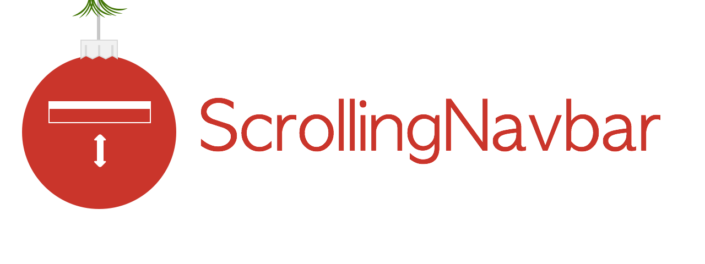

<p align="center">
  
</p>

[](http://www.cocoapods.org/?q=amscrollingnavbar)
[](https://travis-ci.org/andreamazz/AMScrollingNavbar)
[](https://gitter.im/andreamazz/AMScrollingNavbar?utm_source=badge&utm_medium=badge&utm_campaign=pr-badge&utm_content=badge)

Scrollable UINavigationBar that follows the scrolling of a UIScrollView or similar view (e.g. UITableView or UIWebView). 
It works like the navigation bar in Chrome or Facebook's app for iOS7.  

I also wrote about this control in [this article](http://andreamazz.github.io/blog/2014/02/01/amscrollingnavbar-creating-a-cocoapod/)

#Screenshot


#Setup

* Add ```pod 'AMScrollingNavbar'``` to your [Podfile](http://cocoapods.org/)
* Run ```pod install```
* Run ```open App.xcworkspace```
* Import ```UIViewController+ScrollingNavbar.h``` in your controller
* Implement the two following methods:
```objc
- (void)viewWillDisappear:(BOOL)animated
{
	[super viewWillDisappear:animated];
	[self showNavBarAnimated:NO];
}

```
* Make sure to stop the scrolling on `dealloc`:
```objc
- (void)dealloc 
{
      [self stopFollowingScrollView];
}
```

#Enable the scrolling with Autolayout

Version 1.1 introduced an Autolayout-friendly way of setting up your view, it's strongly recommended the use of this method: 
- Setup your view using autolayout
- Create an outlet of the top constraint of the first view sitting below the navigation bar
- Enable the scrolling with this method:
```objc
[self followScrollView:self.scrollView usingTopConstraint:self.topLayoutConstraint];
```
Make sure to check the project sample to have a better understanding of how Autolayout constraints need to be set.

#Enable the scrolling without Autolayout

This version does not require autolayout, to enable the scrolling effect you simply need to call followScrollView: providing the UIView's instance that will be tracked, like this:
```objc
[self followScrollView:self.scrollView];
```
You can also set a delay (in points) for the gesture that reveals the navigation bar.
```objc
[self followScrollView:self.scrollView withDelay:60];
```

Make sure to have a ```barTintColor``` for your ```UINavigationBar```, or you won't see the fade-in and fade-out effects.
Also make sure that you are not using a translucent navigation bar. E.g., in your controller:
```objc
[self.navigationController.navigationBar setTranslucent:NO];
```

Set the view constraints
--------------------
Make sure to set your scrollview's constraint properly. Please note that the library changes the scrollview's superview frame.


Quick Setup Video
--------------------
You can find a video with the full setup [here](https://vimeo.com/92721470)

Using it with UITableViewController or UICollectionViewController
--------------------
If you are not using a plain `UIViewController` you have to enable this property:
```objc
[self setUseSuperview:NO];
```

Delegate
--------------------
You can implement the `AMScrollingNavbarDelegate` protocol to receive these messages:
```objc
- (void)navigationBarDidChangeToCollapsed:(BOOL)collapsed;
- (void)navigationBarDidChangeToExpanded:(BOOL)expanded;
```

MIT License
--------------------
    The MIT License (MIT)

    Copyright (c) 2014 Andrea Mazzini

    Permission is hereby granted, free of charge, to any person obtaining a copy of
    this software and associated documentation files (the "Software"), to deal in
    the Software without restriction, including without limitation the rights to
    use, copy, modify, merge, publish, distribute, sublicense, and/or sell copies of
    the Software, and to permit persons to whom the Software is furnished to do so,
    subject to the following conditions:

    The above copyright notice and this permission notice shall be included in all
    copies or substantial portions of the Software.

    THE SOFTWARE IS PROVIDED "AS IS", WITHOUT WARRANTY OF ANY KIND, EXPRESS OR
    IMPLIED, INCLUDING BUT NOT LIMITED TO THE WARRANTIES OF MERCHANTABILITY, FITNESS
    FOR A PARTICULAR PURPOSE AND NONINFRINGEMENT. IN NO EVENT SHALL THE AUTHORS OR
    COPYRIGHT HOLDERS BE LIABLE FOR ANY CLAIM, DAMAGES OR OTHER LIABILITY, WHETHER
    IN AN ACTION OF CONTRACT, TORT OR OTHERWISE, ARISING FROM, OUT OF OR IN
    CONNECTION WITH THE SOFTWARE OR THE USE OR OTHER DEALINGS IN THE SOFTWARE.


